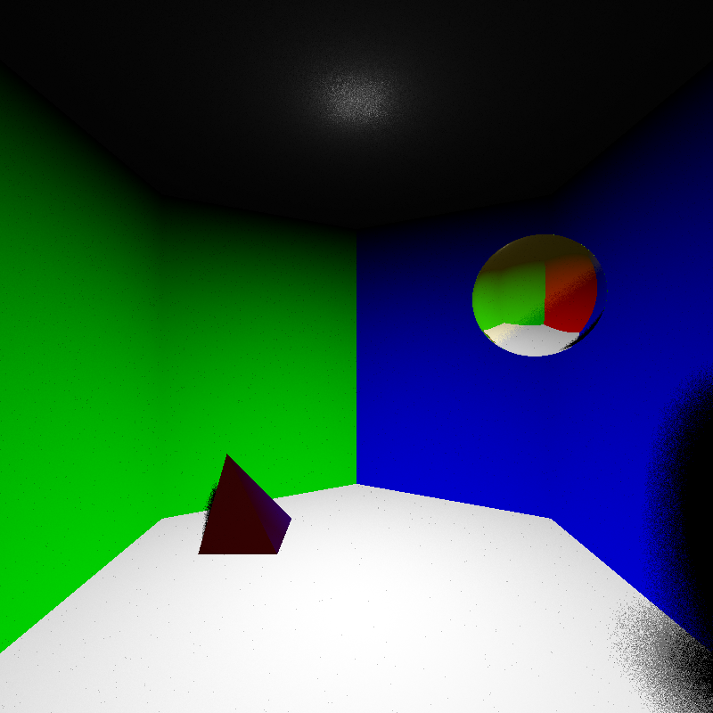
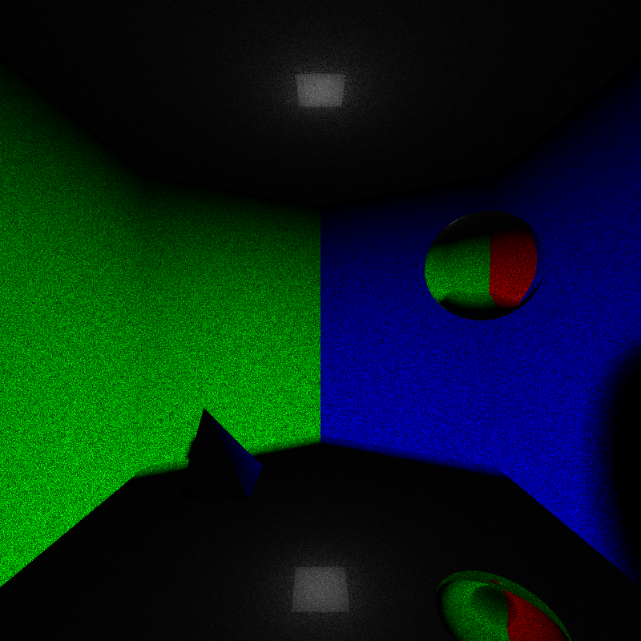
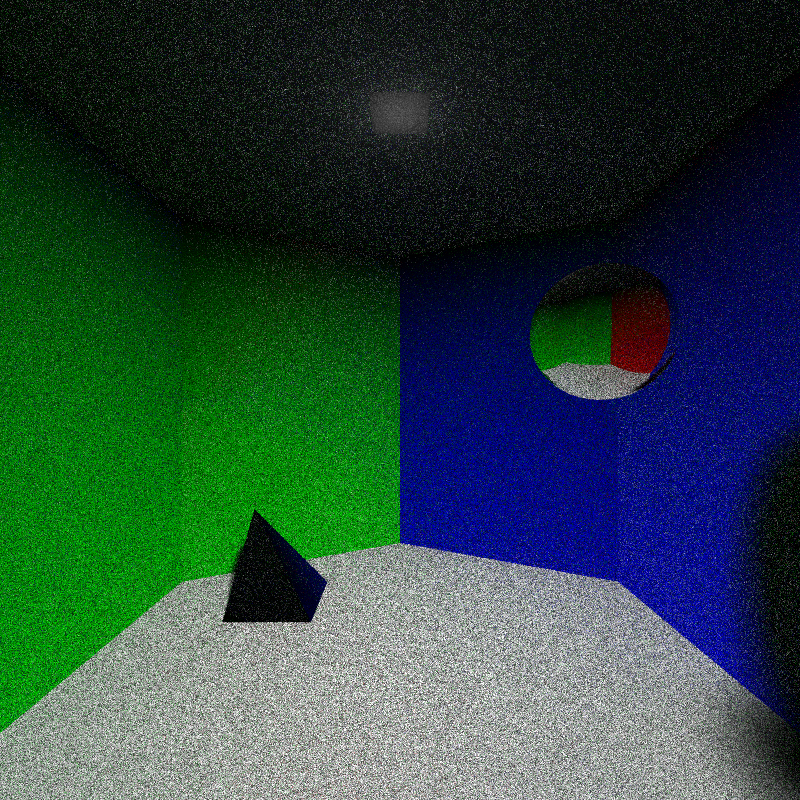
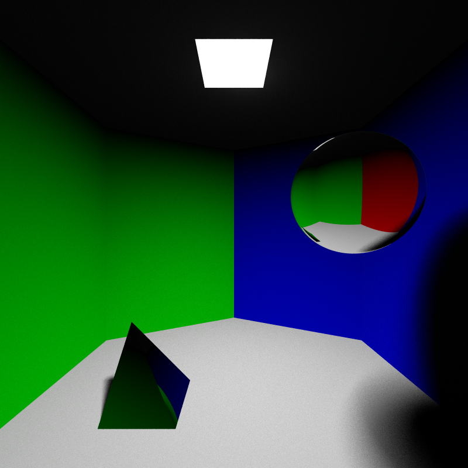

# Monte Carlo Raytracer for TNCG-015

## Features

* Polygonial- and implicit objects, respectively.*
* Shadow ray support has been added for 'direct' shading.
* Perfect reflectors

\**(Currently presets only exist for tetrahedrons as well as spheres, respectively.)*
## Changelog

### "2021-01-06: Shadow ray were added!"

### "2021-01-09: Added perfect reflectors (sphere and left wall)"

In the second image, the color at each ray-intersection is blended between the surface color and the color of the reflected ray. Shadow rays were also calculated at each ray-intersection spawned in the ray-tree.

### "2020-01-12: Added diffuse reflections and refactored perfect reflectors"

The color blending between the hit surfaces' colors and the reflected rays was removed for perfect reflectors. Now the color at each intersection is determined only by direct light contribution and the color of the reflected ray.

Diffuse reflections were added as well by sampling random rays on the hemisphere around the hit position. The outgoing direction is calculated using local spherical coordinates and then transforming them into global coordinates. There are still some issues with noise in the image that need to be dealt with.

### "2020-01-24: Final results after fixing emission and moving objects.

Previous issues where the light source emission and color values were not weighted properly were fixed so that a white color from light source will always be the highest value and objects in the scene were moved and altered slightly to better show the shadows and surfaces.
