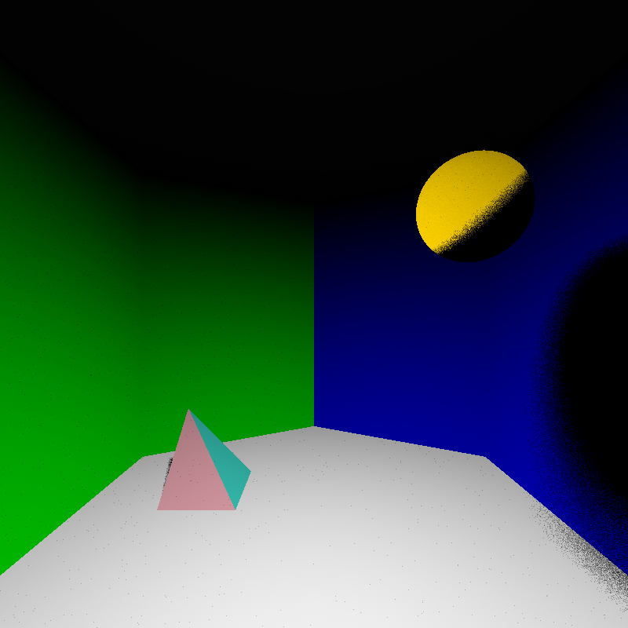

# Monte Carlo Raytracer for TNCG-015

## Features

* Polygonial- and implicit objects, respectively.*
* Shadow ray support has been added for 'direct' shading.

## Screenshots

\**(Currently presets only exist for tetrahedrons as well as spheres, respectively.)*
